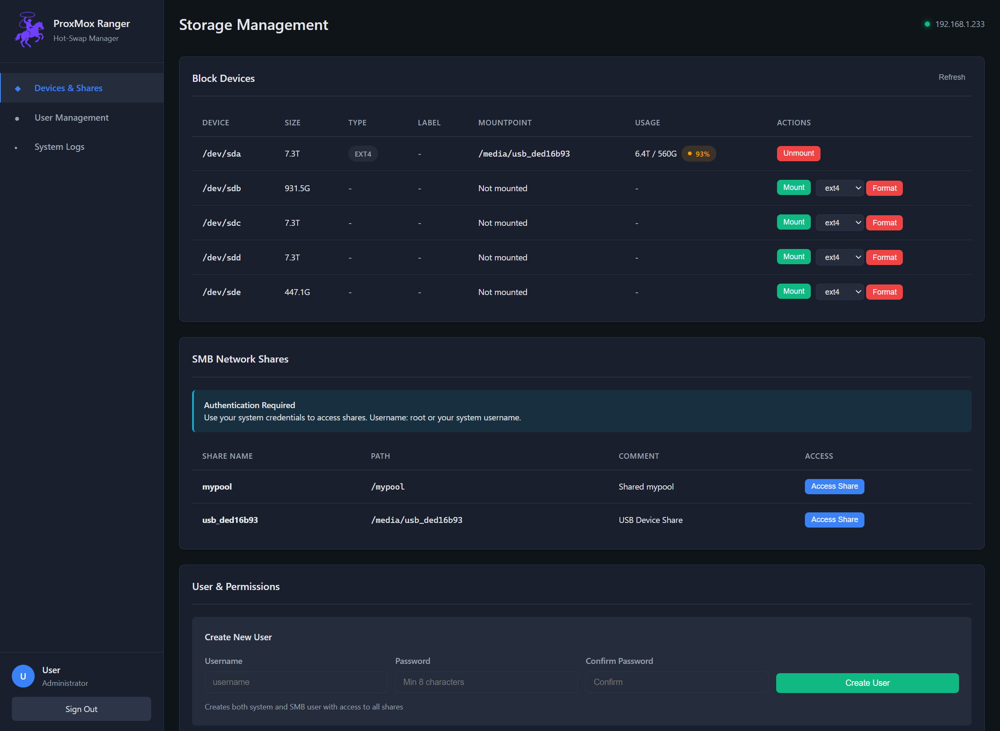

# ProxMox Ranger

<p align="center">
  
</p>

<p align="center">
  <strong>A modern, secure web-based hot-swap storage manager for Proxmox VE</strong>
</p>

<!-- Project motivation + screenshot for the repository page summary -->
<p align="center">
  <strong>Motivation</strong>
</p>
ProxMox Ranger was built so that anyone running Proxmox on cluster/compute nodes can easily expose and access node-local block storage via SMB without spinning up a VM. It also makes it simple for nodes to access SMB shares hosted on other nodes — great for small clusters and shared local storage workflows.

<p align="center">
  
</p>

<p align="center">
  
  
  
</p>

## Prerequisites

**Important:** ProxMox Ranger (PMR) is a dashboard and management interface for SMB and ZFS shares. It does not automatically configure or create shares for you. You must set up your SMB shares and ZFS pools/datasets manually within Proxmox VE or Debian before using PMR.

### SMB Share Setup
- Configure Samba shares in `/etc/samba/smb.conf`
- Create user accounts with `smbpasswd`
- Set appropriate permissions and access controls

### ZFS Share Setup
- Create ZFS pools and datasets using `zpool` and `zfs` commands
- Configure share properties (`sharenfs`, `sharesmb`)
- Set permissions, quotas, and other dataset properties

PMR will then display and help manage these existing shares through its web interface, providing a convenient dashboard for monitoring and basic operations.

---

## Overview

**ProxMox Ranger** is a powerful, browser-based management interface designed specifically for handling hot-swappable storage devices in Proxmox VE environments. With its modern dark-themed UI, built-in authentication, and responsive design, ProxMox Ranger makes storage management effortless whether you're at your desk or on the go.

### Why ProxMox Ranger?

Managing hot-swap drives in a home lab or production Proxmox environment shouldn't require complex shell commands or risky manual operations. ProxMox Ranger provides:

- **Safe hot-swap operations** without downtime
- **Automatic SMB/CIFS network share creation** with one click
- **User permission management** integrated with your Proxmox host
- **Real-time monitoring** of all connected storage devices
- **Secure authentication** using your existing Proxmox credentials
- **Beautiful, responsive interface** that works on any device

---

## Features

### Core Functionality

- **🔄 Hot-Swap Management**
  - Safely mount and unmount USB and SATA devices without system downtime
  - Automatic detection of block devices (USB drives, SATA drives)
  - One-click mount/unmount operations with safety checks

- **🌐 Network Share Management**
  - Instant SMB/CIFS share creation for mounted devices
  - Integrated with Samba for Windows/Mac/Linux compatibility
  - Automatic share configuration with proper permissions

- **👥 User & Permissions Management**
  - View all Samba users and their access rights
  - Add/remove users with automatic permission updates
  - Integration with Proxmox host user authentication

- **📊 Real-Time Monitoring**
  - Live device status (mounted/unmounted)
  - Storage capacity and usage statistics
  - Visual indicators for device health
  - Network share status tracking

- **🌐 Web Services Discovery** *(New in v1.3)*
  - Automatic port scanning to discover web services on nodes, VMs, and LXCs
  - Full port range scanning (1-65535) with persistent progress tracking
  - Live terminal showing real-time scan progress with ETA
  - Proxmox API integration for VM/LXC source identification
  - Clickable service links that open in new browser tabs
  - Persistent scans that survive browser refreshes
  - Automatic service identification (Proxmox, Portainer, Grafana, etc.)
  - Background scanning every 15 minutes with manual refresh option

### Security & Authentication

- **🔐 Secure Login System**
  - Authenticate using Proxmox host credentials (PAM)
  - Session-based authentication with 12-hour timeout
  - IP whitelist protection for network access control
  - Built-in user role display

- **🛡️ Network Security**
  - Configurable IP whitelist (default: private networks only)
  - No hardcoded credentials
  - Secure credential verification against system shadow file

### Modern User Interface

- ** Professional Dark Theme**
  - Inspired by modern dashboard interfaces (ProxMenux Monitor, Aria)
  - Clean, minimal design with consistent spacing
  - High contrast for easy readability
  - Custom logo integration

- ** Fully Responsive**
  - Works seamlessly on desktop, tablet, and mobile
  - Touch-optimized for mobile devices
  - Adaptive layouts for all screen sizes
  - Portrait and landscape orientation support

- ** Performance**
  - Fast, lightweight Flask backend
  - Minimal resource usage
  - Real-time updates without page reloads
  - Efficient data caching

---

## 📸 Screenshots

### Main Dashboard
> Modern dark-themed interface showing all connected storage devices with status indicators

### User Management
> View and manage Samba users with their permissions and access levels

### System Logs
> Clean log viewer with syntax highlighting for troubleshooting

---

## Quick Start

### One-Command Installation

```bash
curl -fsSL https://raw.githubusercontent.com/peterjohannmedina/ProxMoxRanger/main/install.sh | bash
```

### What Gets Installed

The installation script automatically:
1. Installs required system dependencies (Python 3, Samba)
2. Sets up Python dependencies (Flask)
3. Deploys the web application to `/usr/local/bin/`
4. Configures Samba for usershare support
5. Creates and starts the systemd service
6. Installs assets (logo, static files) to `/usr/local/bin/pmranger/`

### Access the Interface

After installation, access ProxMox Ranger at:
```
http://YOUR_PROXMOX_IP:8010
```

**Default Login:** Use your Proxmox host credentials (e.g., root and your root password)

---

## 📋 Requirements

### System Requirements

- **Proxmox VE**: 7.0 or higher
- **Python**: 3.7 or higher
- **Samba**: For network share functionality
- **Access**: Root or sudo privileges required

### Network Requirements

- **Port 8010**: Must be accessible from your management network (default, configurable during installation)
- **Private Network**: Recommended for security (IP whitelist enforced)

---

## 🔧 Installation

### Manual Installation

1. **Clone the repository**
   ```bash
   git clone https://github.com/peterjohannmedina/ProxMoxRanger.git
   cd ProxMoxRanger
   ```

2. **Run the installer**
   ```bash
   sudo bash install.sh
   ```

3. **Verify installation**
   ```bash
   systemctl status proxmox-ranger.service
   ```

4. **Access the web UI**
   - Open browser to `http://YOUR_PROXMOX_IP:8010`
   - Login with Proxmox credentials

For detailed installation steps, see [INSTALL.md](INSTALL.md)

---

## 🔄 Upgrading from v1.0 to v1.2

### Quick Upgrade (Recommended)

If you have ProxMox Ranger v1.0 installed, upgrading to v1.2 is simple - **no uninstall required!**

```bash
# 1. Download v1.2
git clone https://github.com/peterjohannmedina/ProxMoxRanger.git /tmp/ProxMoxRanger_v1.2
cd /tmp/ProxMoxRanger_v1.2

# 2. Run installer (will upgrade automatically)
sudo bash install.sh

# 3. Verify upgrade
curl http://localhost:8010/api/info
# Should show: "version": "1.2.0"

# 4. Check UI - should see "v1.2" in sidebar
```

### What Gets Upgraded

| Component | v1.0 | v1.2 | Notes |
|-----------|------|------|-------|
| **Binary** | `/opt/proxmox-ranger/bin/webui` | `/opt/proxmox-ranger/bin/pmranger` | New binary created |
| **Script** | `webui.py` | `pmranger.py` | Renamed for consistency |
| **Service** | References `webui` | References `pmranger` | Auto-updated |
| **Port** | 8010 | 8010 | No change |
| **Settings** | Preserved | Preserved | No data loss |

### New Features in v1.2

- **🌐 Multi-Node Support** - Manage multiple Proxmox nodes from one interface
- **🔍 Auto-Discovery** - Automatically find other ProxMox Ranger instances on your network
- **📡 REST API** - 10 new API endpoints for automation and inter-node communication
- **🖥️ Node Selector** - Dropdown in sidebar to switch between nodes
- **📌 Version Display** - Shows "v1.2" in the UI

### Safe Upgrade (Stop Service First)

If you want to be extra cautious:

```bash
# Stop the service
sudo systemctl stop proxmox-ranger

# Run upgrade
cd /tmp/ProxMoxRanger_v1.2
sudo bash install.sh

# Service will auto-start after upgrade
```

### Clean Install (Alternative)

If you prefer a fresh installation:

```bash
# 1. Uninstall v1.0
sudo systemctl stop proxmox-ranger
sudo systemctl disable proxmox-ranger
sudo rm -rf /opt/proxmox-ranger
sudo rm -f /etc/systemd/system/proxmox-ranger.service
sudo systemctl daemon-reload

# 2. Install v1.2
cd /tmp/ProxMoxRanger_v1.2
sudo bash install.sh
```

### Verify Upgrade Success

```bash
# Check service is running
systemctl status proxmox-ranger

# Check version via API
curl http://localhost:8010/api/info | grep version

# Check port is open
ss -tlnp | grep :8010

# Access UI and look for:
# - "Hot-Swap Manager v1.2" in sidebar
# - Node selector dropdown under logo
# - "🔍 Scan" button
```

### Multi-Node Setup (New in v1.2)

After upgrading all nodes, enable multi-node management:

1. **Install v1.2 on each node** using the same upgrade process
2. **Access any node's UI** at `http://NODE_IP:8010/shares`
3. **Click the "🔍 Scan" button** to discover other nodes
4. **Switch between nodes** using the dropdown in the sidebar

See [MULTINODE_GUIDE.md](MULTINODE_GUIDE.md) for detailed multi-node setup instructions.

### Troubleshooting Upgrade

**Service won't start after upgrade:**
```bash
# Check logs
journalctl -u proxmox-ranger -n 50

# Check for errors
tail -f /var/log/hotswap-webui.log
```

**Old `webui` binary interfering:**
```bash
# Remove old binary (optional cleanup)
sudo rm -f /opt/proxmox-ranger/bin/webui
```

**Port 8010 not responding:**
```bash
# Check if something else is using the port
sudo ss -tlnp | grep :8010

# Restart service
sudo systemctl restart proxmox-ranger
```

---

##  Usage

### Managing Storage Devices

1. **View Devices**
   - Navigate to the "Devices & Shares" section
   - See all connected block devices with their status

2. **Mount a Device**
   - Click "Mount" next to an unmounted device
   - Device is automatically mounted to `/media/DEVICE_ID`
   - Status updates in real-time

3. **Create Network Share**
   - Click "Share" next to a mounted device
   - SMB/CIFS share is created instantly
   - Accessible from Windows, Mac, or Linux

4. **Unmount Safely**
   - Click "Unmount" to safely disconnect
   - Automatic safety checks prevent data loss

### Managing Users

1. Navigate to "User Management" section
2. View existing Samba users and permissions
3. Add new users via the interface
4. Remove users with automatic permission cleanup

### Monitoring Logs

1. Click "System Logs" in the sidebar
2. View manager script logs for device operations
3. Check web UI logs for application events
4. Real-time log updates

---

## ⚙️ Configuration

### IP Whitelist

Edit `/opt/proxmox-ranger/bin/webui` to customize allowed IP ranges:

```python
ALLOWED_IPS = [
    '127.0.0.1',          # Localhost
    '::1',                # IPv6 localhost
    '192.168.0.0/16',     # Private network (adjust to your subnet)
    '10.0.0.0/8',         # Alternative private range
    '172.16.0.0/12',      # Alternative private range
]
```

### Service Management

```bash
# Check status
systemctl status proxmox-ranger.service

# Start service
systemctl start proxmox-ranger.service

# Stop service
systemctl stop proxmox-ranger.service

# Restart service
systemctl restart proxmox-ranger.service

# Enable on boot
systemctl enable proxmox-ranger.service

# View real-time logs
journalctl -u proxmox-ranger.service -f
```

### Application Logs

```bash
# Web UI logs
tail -f /var/log/proxmox-ranger.log

# Manager script logs
tail -f /var/log/hotswap-manager.log
```

---

## 📁 Project Structure

```
pmranger/
├── assets/
│   └── RangerMark.png          # Application logo
├── docs/
│   └── preview.html            # UI preview (no server needed)
├── scripts/
│   ├── webui.py                # Flask web application (main)
│   └── hotswap-manager.sh      # Device management backend
├── .gitignore                  # Git ignore patterns
├── install.sh                  # Automated installer
├── INSTALL.md                  # Detailed installation guide
├── LICENSE                     # MIT License
├── README.md                   # This file
└── requirements.txt            # Python dependencies
```

### Key Components

- **webui.py**: Flask application handling web UI, authentication, and API
- **hotswap-manager.sh**: Bash script for device mount/unmount/share operations
- **install.sh**: Automated deployment script with dependency management
- **preview.html**: Standalone HTML preview of the UI design

---

## 🔒 Security Considerations

### Built-in Security

✅ **IP Whitelisting**: Restricts access to trusted networks
✅ **PAM Authentication**: Uses system credentials (no separate passwords)
✅ **Session Management**: 12-hour timeout with secure cookies
✅ **No Hardcoded Secrets**: All credentials from system authentication

### Recommendations for Production

- **Use Reverse Proxy**: Deploy nginx/Apache with SSL for HTTPS
- **Restrict Network Access**: Limit to management network or VPN
- **Regular Updates**: Keep Proxmox and system packages updated
- **Firewall Rules**: Block port 8010 from public internet
- **Monitor Logs**: Regular review of access and operation logs

### Default Security Settings

```python
# Default IP whitelist includes:
- 127.0.0.1 (localhost)
- 192.168.0.0/16 (private networks)
- 10.0.0.0/8 (private networks)
- 172.16.0.0/12 (private networks)
```

---

## Troubleshooting

### Service Won't Start

```bash
# Check service status
systemctl status proxmox-ranger.service

# View detailed logs
journalctl -u proxmox-ranger.service -n 100 --no-pager

# Check application logs
tail -n 50 /var/log/proxmox-ranger.log
```

### Can't Access Web UI

1. **Verify service is running**
   ```bash
   systemctl is-active proxmox-ranger.service
   ```

2. **Check firewall**
   ```bash
   iptables -L -n | grep 8010
   ```

3. **Verify IP whitelist**
   - Ensure your IP is in the ALLOWED_IPS list
   - Edit `/opt/proxmox-ranger/bin/webui` if needed

4. **Test locally**
   ```bash
   curl http://localhost:8010/login
   ```

### Login Issues

- **Verify credentials**: Use the same credentials as Proxmox host login
- **Check PAM**: Ensure user exists in `/etc/shadow`
- **Review logs**: Check `/var/log/hotswap-webui.log` for auth failures

### Mount/Unmount Problems

- **Check permissions**: Ensure script has execute permissions
  ```bash
  chmod +x /usr/local/bin/hotswap-manager.sh
  ```

- **Check for active processes**
  ```bash
  lsof | grep /media/DEVICE_ID
  ```

- **Review manager logs**
  ```bash
  tail -f /var/log/hotswap-manager.log
  ```

See [INSTALL.md](INSTALL.md) for comprehensive troubleshooting.

---

##  Contributing

Contributions are welcome and appreciated! Here's how you can help:

### Ways to Contribute

- **Report bugs** via GitHub Issues
-  **Suggest features** in GitHub Discussions
-  **Improve documentation**
-  **Submit pull requests**

### Development Process

1. Fork the repository
2. Create a feature branch (`git checkout -b feature/AmazingFeature`)
3. Make your changes
4. Test thoroughly
5. Commit with clear messages (`git commit -m 'Add AmazingFeature'`)
6. Push to your fork (`git push origin feature/AmazingFeature`)
7. Open a Pull Request

### Code Style

- Python: Follow PEP 8
- Shell scripts: Use shellcheck
- HTML/CSS: Maintain existing dark theme style
- Comments: Document complex logic

---

## 📄 License

This project is licensed under the **MIT License** - see the [LICENSE](LICENSE) file for details.

### MIT License Summary

✅ Commercial use
✅ Modification
✅ Distribution
✅ Private use

---

##  Acknowledgments

- **Proxmox Community**: For the amazing virtualization platform
- **Flask Framework**: For the lightweight Python web framework
- **Design Inspiration**: ProxMenux Monitor and Aria dashboards
- **Logo**: Custom ProxMox Ranger branding

---

## 📞 Support & Resources

- **Documentation**: [Installation Guide](INSTALL.md)
- **Bug Reports**: [GitHub Issues](https://github.com/peterjohannmedina/ProxMoxRanger/issues)
- **Feature Requests**: [GitHub Discussions](https://github.com/peterjohannmedina/ProxMoxRanger/discussions)
- **Community**: [Proxmox Forums](https://forum.proxmox.com/)

---

## 🗑️ Uninstallation

ProxMox Ranger can be safely uninstalled without affecting your existing storage configuration or mounted devices.

### Using the Uninstall Script

```bash
cd /path/to/ProxMoxRanger
bash uninstall.sh
```

The uninstall script provides an **interactive removal process** that allows you to choose what to remove.

### What Gets Removed

The uninstaller will automatically remove:

- ✅ **ProxMox Ranger Application**
  - Service: `/etc/systemd/system/proxmox-ranger.service`
  - Installation directory: `/opt/proxmox-ranger/`
  - Symlinks: `/usr/local/bin/pmranger`, `/usr/local/bin/pmranger-cli`

**Optional Removals** (you will be prompted):
- Samba usershare configuration in `/etc/samba/smb.conf`
- Usershares directory (⚠️ WARNING: Deletes ALL shares)
- Log files in `/var/log/`

### What Does NOT Get Removed

The uninstaller is designed to be **non-destructive** to your existing infrastructure:

- ❌ **Mounted Devices** - All currently mounted devices remain mounted
- ❌ **Active SMB Shares** - Existing Samba shares remain active and accessible
- ❌ **ZFS Pools/Datasets** - Your ZFS configuration is completely untouched
- ❌ **ACL Permissions** - File and directory permissions remain unchanged
- ❌ **Device Mounts in `/media/`** - Mounted storage stays mounted
- ❌ **Samba Users** - User accounts and passwords remain intact
- ❌ **System Packages** - Python, Samba, and other dependencies are not removed

### Important Notes

⚠️ **Before Uninstalling:**
- The application is stopped immediately when uninstalled
- Mounted devices and shares remain accessible but can no longer be managed through the web UI
- Use `pmranger-cli` commands before uninstalling if you need to clean up shares first

### Manual Cleanup (If Needed)

If you want to manually remove shares and unmount devices before uninstalling:

```bash
# View all current shares
net usershare list

# Delete a specific share
net usershare delete SHARENAME

# Unmount a device
umount /media/DEVICE_NAME
```

### Reinstallation

To reinstall ProxMox Ranger after uninstalling:

```bash
curl -fsSL https://raw.githubusercontent.com/peterjohannmedina/ProxMoxRanger/main/install.sh | bash
```

---

## 📊 Stats & Info

- **Language**: Python, Bash, HTML/CSS
- **Framework**: Flask 2.3+
- **License**: MIT
- **Platform**: Proxmox VE 7+
- **Service Port**: 8010 (default, configurable)

---


